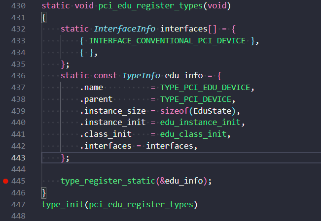
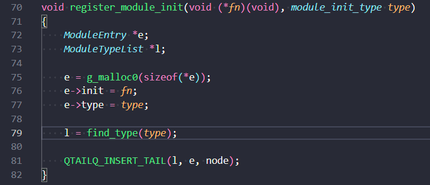
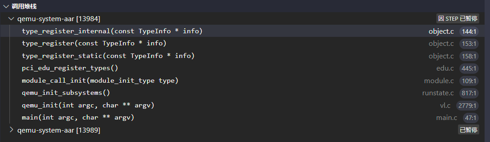
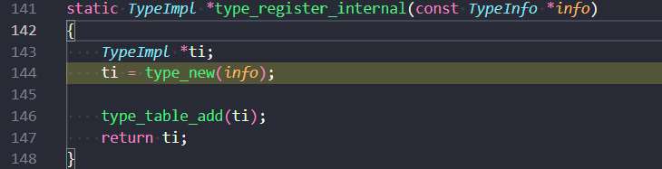
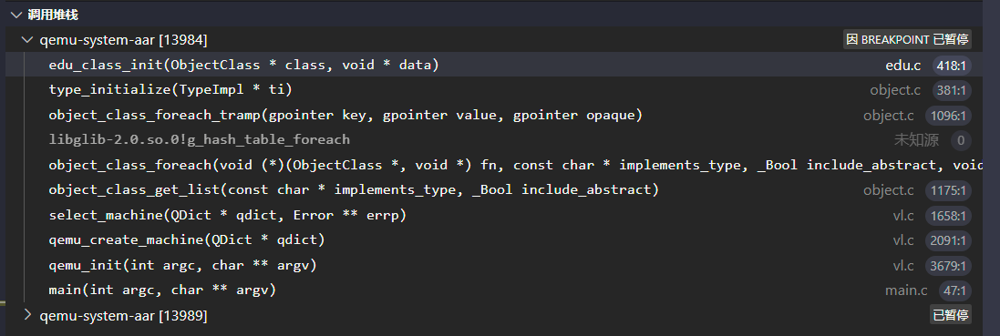
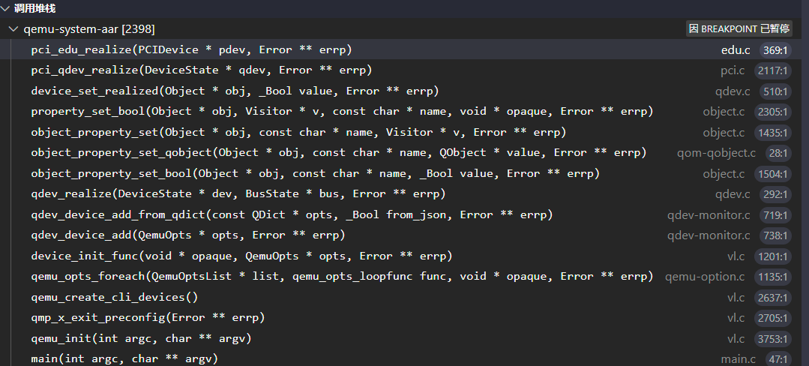

# QOM

- QOM用c语言基本上实现了C++的封装、继承、多态等特点，qemu通过QOM对各种资源进行抽象、管理
- qemu的QOM框架，主要包括3部分：类型注册、类型初始化和对象初始化

## 1. 类型注册

### 1.1 初始化全局链表（main函数前）
- 在main函数执行前，通过type_init()宏将所有类型，添加到init_type_list[QOM]链表上
- 注意添加到链表上的，是一个void(*init)(void)初始化函数
- 以edu设备为例，/hw/misc/edu.c中，会调用type_init将pci_edu_register_types函数添加到init_type_list[QOM]链表上：

- 而type_init宏定义展开后，可以看到最终调用到register_module_init函数中，确实是根据edu设备给定的信息，创建了一个ModuleEntry节点，并且ModuleEntry->init = pci_edu_register_types，ModuleEntry->type = MODULE_INIT_QOM，最终将ModuleEntry节点插入到init_type_list[QOM]链表上：

### 1.2 遍历全局链表（main函数后）
- 在main函数中，通过module_call_init(MODULE_INIT_QOM)，遍历init_type_list[QOM]上挂的init函数
- init函数中，每个类型会给定TypeInfo，系统将其转化为TypeImpl
- 然后系统将这个TypeImpl类型，添加到静态的type_table中
- 至此，所有类型注册到全局的type_table中
- 以edu设备为例，前面已经将edu设备插入到init_type_list[QOM]链表上，在module_call_init(MODULE_INIT_QOM)函数执行时，就会进入注册的pci_edu_register_types函数中，最终调用到type_register_internal函数中：

- 该函数的作用是，将edu设备指定的TypeInfo结构体，转化到TypeImpl结构体，并将TypeImpl结构体添加到静态的type_table中：

## 2. 类型初始化
- 在main -> qemu_init -> qemu_create -> select_machine -> object_class_get-list -> object_class_foreach ---> type_initialize调用后，object_class_foreach会遍历type_table中每一个类型
- type_initialize中，会根据TypeImpl中的信息，先递归初始化父类型，生成一个C++中的类型继承关系。包括内存排布，都是和C++的父子类型一样的排布
- 最后调用该类型的TypeImpl.class_init函数，完成该类型的初始化工作
- 以edu设备为例，edu设备的类型初始化，最终是调用到edu_class_init函数中，这也是edu设备前面注册的TypeInfo->class_init，只不过QOM系统将其转化成了TypeImpl->class_init成员

## 3. 对象初始化
- 以edu设备为例，edu对象初始化调用栈如下：

- 该调用过程可以拆成两个部分。1）启动参数中配置了edu设备，所以采用qemu_opts_foreach参数解析出来edu设备；2）调用edu类型的对象初始化函数pci_edu_realize
- 我们主要关注edu类型的对象初始化过程